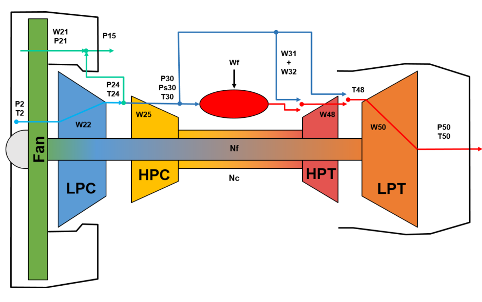

# Multi-Objective Optimization of Extreme Learning Machine for Remaining Useful Life Prediction
This is the official repo for the paper "Multi-Objective Optimization of Extreme Learning Machine for Remaining Useful Life Prediction" which aims to seach a propoer neural architecture of ELM for RUL prediction. 
This project is based on the libraries available at: [https://github.com/DEAP/deap](https://github.com/DEAP/deap) for GA and [https://github.com/akusok/hpelm](https://github.com/akusok/hpelm) for ELM

This work is evaluated on N-CMAPSS dataset
Turbo fan engine           |  CMAPSS [[1]](#1)
:----------------------------:|:----------------------:
  |  


## Prerequisites
To prepare the data for your experiments, please refer to our [N-CMAPSS_DL repository](https://github.com/mohyunho/N-CMAPSS_DL) 
that helps create numpy arrays for training/test ML&DL models from N-CMAPSS data file. By simply running a given python script, the data will be ready for the NAS/inference experiments.  <br/>

## MOO ELM
<p align="center">
  
</p>

The objective of this study is to search for the best ELM architectures in terms of a trade-off between RUL prediction error and training time, the latter being determined by the number of trainable parameters. (In detail, we consider the optimization of the number and type of neurons & L2 regularization prameter in a SLFN when we train it by ELM). <br/>
After preparing the data from the N-CMAPSS, <br/>
you can find the trade-off solution by running the python codes below:
```bash
python3 enas_elm_moo.py -w 1 -s 1 --pop 50 --gen 50
```
&ndash;  w : window length <br/>
&ndash;  s : stride of window <br/>
&ndash;  pop : population size for the evolutionary algorithm <br/>
&ndash;  gen : the number of generations to evolution <br/>


Following our experiments on the N-CMAPSS dataset, the optimized ELMs perform slightly worse than the BPNNs in terms of RUL prediction error, they require a significantly shorter (up to 2 orders of magnitude) training time.<br/>
<p align="center">
  
</p>


To cite this code use
```
@inproceedings{mo2022MOEAELM,
	title = {Multi-Objective Optimization of Extreme Learning Machine for Remaining Useful Life Prediction},
	booktitle = {Applications of Evolutionary Computation},
	author = {Mo, Hyunho and Iacca, Giovanni},
	year = {2022},
	note = {to appear}
}
```

## References
<a id="1">[1]</a> 
Frederick, Dean & DeCastro, Jonathan & Litt, Jonathan. (2007). User's Guide for the Commercial Modular Aero-Propulsion System Simulation (C-MAPSS). NASA Technical Manuscript. 2007–215026. 

<a id="2">[2]</a> 
Chao, Manuel Arias, Chetan Kulkarni, Kai Goebel, and Olga Fink. "Aircraft Engine Run-to-Failure Dataset under Real Flight Conditions for Prognostics and Diagnostics." Data. 2021; 6(1):5. https://doi.org/10.3390/data6010005

<a id="3">[3]</a> 
Chao, Manuel Arias, Chetan Kulkarni, Kai Goebel, and Olga Fink. "Fusing physics-based and deep learning models for prognostics." Reliability Engineering & System Safety 217 (2022): 107961.

<a id="3">[4]</a> 
Mo, Hyunho, and Giovanni Iacca. "Multi-Objective Optimization of Extreme Learning Machine for Remaining Useful Life Prediction." EvoApplications, part of EvoStar 2022 (2022), to appear.

