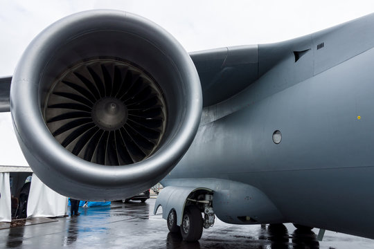
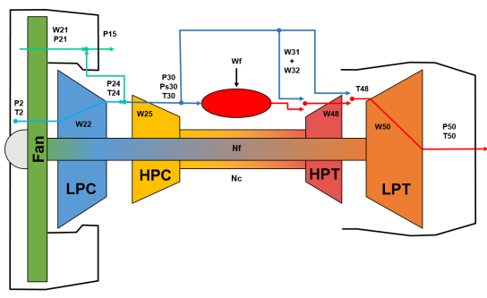

# Multi-Objective Optimization of Extreme Learning Machine for Remaining Useful Life Prediction
This is the official repo for the paper "Multi-Objective Optimization of Extreme Learning Machine for Remaining Useful Life Prediction" which aims to seach a propoer neural architecture of ELM for RUL prediction. 
This project is based on the libraries available at: [https://github.com/DEAP/deap](https://github.com/DEAP/deap) for GA and [https://github.com/akusok/hpelm](https://github.com/akusok/hpelm) for ELM

This work is evaluated on N-CMAPSS dataset
Turbo fan engine           |  CMAPSS [[1]](#1)
:----------------------------:|:----------------------:
  |  


## Prerequisites
To prepare the data for your experiments, please refer to our [N-CMAPSS_DL repository](https://github.com/mohyunho/N-CMAPSS_DL) 
that helps create numpy arrays for training/test ML&DL models from N-CMAPSS data file. By simply running a given python script, the data will be ready for the NAS/inference experiments.   

## MOO ELM
<p align="center">
  
</p>


<p align="center">
  
</p>


To cite this code use
```
@inproceedings{mo2022MOEAELM,
	title = {Multi-Objective Optimization of Extreme Learning Machine for Remaining Useful Life Prediction},
	booktitle = {Applications of Evolutionary Computation},
	author = {Mo, Hyunho and Iacca, Giovanni},
	year = {2022},
	note = {to appear}
}
```
